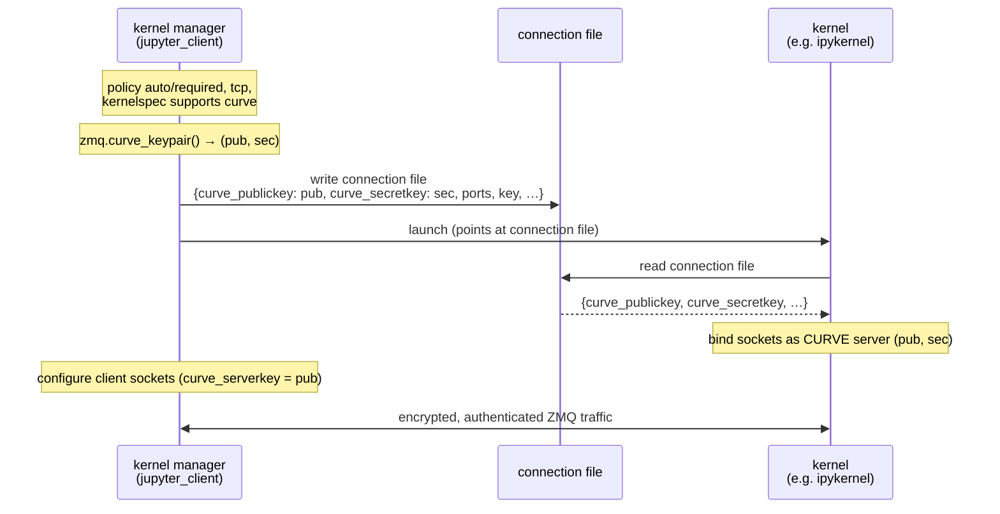

# Transport encryption for ZMQ communication

## Summary

We propose to support encrypting the traffic exchanged between the kernels and client, adding a dedicated stanza in `kernelspec` to enable kernels to communicate support for encryption, adding a new set of fields for key exhange in the connection file, and using CurveZMQ protocol as a default implementation of such an encryption.

## Motivation

With the default TCP transport non-authenticated clients with access to ports on the same machine are currently able to monitor IOPub, accessing any secrets exchanged during kernel runtime (code, outputs, etc). It can be only prevented by using ICP transport and file permissions.

## Guide-level explanation

The five ZMQ channels a kernel exposes (`shell`, `iopub`, `stdin`, `control`, and `heartbeat`) can now be wrapped in _transport encryption_: the connection between a client and a kernel is encrypted and mutually authenticated at the socket level, using ZeroMQ's [CurveZMQ](https://rfc.zeromq.org/spec/26/) protocol. CurveZMQ provides forward secrecy (it negotiates ephemeral per-connection session keys, so traffic captured today cannot be decrypted later even if the long-term keys leak) and connection-level authentication (a peer that does not hold the right key never gets its messages delivered, instead of being filtered out after the fact by an HMAC check).

Encryption is off by default and is controlled by a single operator-facing setting on the kernel manager, `transport_encryption`, which takes one of three values:

- `disabled` (the default): kernels start exactly as they do today, unencrypted; nothing changes.
- `auto`: a kernel is started encrypted _only if_ its kernelspec advertises that it understands encryption; kernels that do not are started unencrypted. This is the value an operator can safely set globally: encryption-capable kernels get encryption, everything else keeps working.
- `required`: every kernel is started encrypted, and starting a kernel whose kernelspec does _not_ advertise encryption support fails fast with a clear error rather than silently falling back to plaintext.

A kernel advertises that it understands encryption through a new key in its `kernel.json` metadata:

```json
{
  "argv": ["...", "{connection_file}"],
  "display_name": "Python 3 (ipykernel)",
  "language": "python",
  "metadata": {
    "supported_encryption": "curve"
  }
}
```

`ipykernel` ships this stanza as of 7.3, so a default Python kernel is encrypted as soon as an operator sets `transport_encryption` to `auto` in their `jupyter_server` or `jupyter_client` configuration, for example:

```python
# jupyter_server_config.py
c.MappingKernelManager.transport_encryption = "auto"
```

From a user's point of view nothing in the notebook experience changes; the difference is purely on the wire. The concrete impact is that a second, unauthenticated process on the same machine can no longer subscribe to a kernel's `iopub` channel and read the code, outputs, and any secrets a user printed; today that is only preventable by switching to the `ipc://` transport and relying on filesystem permissions.

How others should think about the feature:

- Kernel authors add one line to their `kernel.json` metadata (`"supported_encryption": "curve"`) and, if their kernel is not built on `ipykernel` or `jupyter_client`, set three socket options (see the reference section) on the sockets they bind. They do _not_ generate or manage keys.
- Client, front-end, and server authors generally get this for free through `jupyter_client` ≥ 8.9 and `jupyter_server` ≥ 2.20; the manager generates the keys and writes them into the connection file.
- Operators flip one setting; the `auto` versus `required` distinction lets them roll encryption out gradually and then enforce it.

There are two new diagnostics a user may notice. When a kernel runs over TCP _without_ encryption, `ipykernel` now logs a warning:

> Kernel is running over TCP without encryption. All traffic, including any secrets in cell outputs, is readable by other processes on this machine. Use the IPC transport or start the kernel through a manager that provisions CurveZMQ keys.

And requesting `transport_encryption` of `required` for a kernel that does not advertise support fails at startup:

> RuntimeError: transport_encryption='required' but kernelspec does not declare `metadata.supported_encryption='curve'`.

We recommend other kernels that decide to implement encryption to emit similar warning and error messages.

## Reference-level explanation

### Trust model and key ownership

The design deliberately reuses the trust model Jupyter already has for the HMAC message-signing `key`: secrets live in the connection file, which is protected by filesystem permissions, and any process that can read the connection file is treated as trusted. CurveZMQ adds transport encryption and connection authentication on top of that model; it does _not_ change where the root secret lives.

Key generation is owned by the client side, concretely the kernel manager's provisioner, not the kernel:

1. Before launch, if the resolved policy is `auto` or `required`, the transport is `tcp`, and the kernel is eligible (the kernelspec advertises `curve`, or the policy is `required`), the provisioner calls `zmq.curve_keypair()` once to produce a public and secret key pair.
2. It writes both into the connection file as two new fields, `curve_publickey` and `curve_secretkey`, each a Z85-encoded, 40-character ASCII string (the standard text encoding of a 32-byte Curve key).
3. The kernel reads the connection file, sees both keys, and binds its sockets as a CurveZMQ server.
4. The manager (and any other local client reading the same connection file) configures its connecting sockets as CurveZMQ clients.

Because the manager generates the keys before launch, it can configure its own sockets immediately and never has to re-read the file. Keys are generated once and reused across restarts: the connection file is preserved across a restart, exactly like `session.key`, so the post-restart kernel and the manager keep matching keys.



### Socket configuration

On the kernel (server) side, for every socket it binds (`shell`, `stdin`, and `control` as `ROUTER`, `iopub` as `XPUB`, and `heartbeat` as `ROUTER`), the kernel sets, _before_ binding:

```python
socket.curve_secretkey = secret   # from connection file
socket.curve_publickey = public   # from connection file
socket.curve_server = True
```

On the client side, for the connecting sockets the behavior differs slightly by channel:

- `shell`, `iopub`, `stdin`, and `control` reuse the keypair from the connection file as their own identity and set `curve_serverkey` to the kernel's public key (which authenticates the server):

  ```python
  socket.curve_secretkey = secret
  socket.curve_publickey = public
  socket.curve_serverkey = public
  ```

- The `heartbeat` client instead generates a fresh ephemeral keypair per socket and only needs the server's public key (`curve_serverkey`); it never receives the secret key. The heartbeat runs in its own ZMQ context and thread (so the GIL cannot stall it), and the curve options are therefore applied when its socket is created inside that thread.

This "simplest version" (a single keypair used by both ends) choice from the variants considered in the pre-proposal is intentional. The connection file already carries the keypair, so reusing it avoids introducing a second key-distribution mechanism. `curve_serverkey` is what actually authenticates the connection; the rest configures encryption.

### The `transport_encryption` policy

The `transport_encryption` setting is configurable on the kernel manager in both `jupyter_client` and `jupyter_server`, with the values `disabled` (the default), `auto`, and `required`. `jupyter_server` is a thin layer: when the policy is not `disabled`, it forwards the policy into the per-kernel launch; the actual key generation, kernelspec check, and connection-file writing happen in `jupyter_client`. Setting the policy to `auto` or `required` while the local `libzmq` lacks Curve support (`zmq.has("curve")` is false) is rejected at configuration time, so the misconfiguration surfaces immediately rather than at first kernel start.

The kernel itself has no encryption toggle of its own; it is purely _data-driven_. It applies Curve options if and only if the connection file it loads contains _both_ `curve_publickey` and `curve_secretkey`. A file with only one of the two is treated as unencrypted.

### Kernelspec capability advertisement

A kernel declares support with `metadata.supported_encryption`. The value is matched case-insensitively and may be either the string `"curve"` or a list containing `"curve"` (leaving room to advertise multiple schemes in future). The check happens _before_ the connection is established: capability cannot be discovered at runtime via `kernel_info_reply`, because by the time a reply could arrive the (unencrypted) connection already exists. This mirrors how JEP 66 gates the handshake pattern on the static `kernel_protocol_version` field.

To implement this JEP we will reflect these additions in the official schemas (JEP 105/106). In the connection file (currently `connectionfile-v1.0.schema.json`, which composes a `kernel_network` and a `signature` group), the two Curve fields fit naturally as a new optional `encryption` group, following the precedent that the `signature_scheme` and `key` material lives in the connection file:

```json
{
  "curve_publickey": "b{E{TUJ[Zxl1)]<>W(c*bEff[.[K]BGJE&4iF=oM",
  "curve_secretkey": "<dQ^&)<Lp#8IUJrWoOpOZ5+xjs]UV$ShhdqSEW))"
}
```

Both keys are optional and MUST appear together; their absence means no transport encryption, which is the legacy behavior. This would bump the schema to a new versioned `$id` (for example `connectionfile-v1.1`).

### Backward compatibility and corner cases

- _Default off._ With `transport_encryption` set to `disabled`, no keys are generated, the kernel launch is identical to today, and the Curve fields are absent from the connection file. A kernel that loads such a file behaves exactly as before.
- `auto` with a non-advertising kernelspec silently starts the kernel unencrypted; `required` with such a kernelspec fails at startup.
- _Transport._ Encryption applies to `tcp` only; `ipc://` connections rely on filesystem permissions as today, and `required` with a non-`tcp` transport is an error.
- _Curve availability._ The check lives on the manager (`zmq.has("curve")`); a `libzmq` built without `libsodium` or Curve support simply never produces a connection file with keys, so the kernel never attempts to apply Curve options.
- _Browser exposure._ `jupyter_server`'s REST API (`/api/kernels`) and WebSocket models carry no Curve fields; the keys exist only in the on-disk connection file and on the server-side manager. CurveZMQ here protects the local-host TCP sockets between the server-side client and the kernel process, not the browser-to-server channel (which is HTTPS/WSS's responsibility).
- _Restart._ Keys are reused across restarts (the connection file is preserved) to allow reconnection on restart.
- _Debugger._ `ipykernel`'s debugger socket, which connects back to the now-encrypted `shell` channel, is configured as a Curve client; the `debugpy` socket is not given Curve options.

### Reference implementation

- `jupyter_client` ≥ 8.9: [#1110](https://github.com/jupyter/jupyter_client/pull/1110) (key generation in the provisioner, connection-file fields, client-socket configuration, the `transport_encryption` setting) and [#1124](https://github.com/jupyter/jupyter_client/pull/1124) (restart key reuse).
- `ipykernel` ≥ 7.3: [#1515](https://github.com/ipython/ipykernel/pull/1515) (kernel-side socket configuration, heartbeat handling, the `supported_encryption` kernelspec metadata, and the unencrypted-TCP warning).
- `jupyter_server` ≥ 2.20: [#1638](https://github.com/jupyter-server/jupyter_server/pull/1638) (the server-level `transport_encryption` toggle and policy propagation).

## Rationale and alternatives

### Rationale

#### Why CurveZMQ as the default implementation

It is the least invasive way to get transport encryption and connection authentication for Jupyter's existing ZMQ topology. Enabling it touches only socket creation (three socket options on each end) and nothing in the message protocol itself: no new message types, no changes to signing, framing, or channel semantics. It is built into `libzmq` and `pyzmq`, provides forward secrecy, and slots directly into the connection-file key-distribution mechanism Jupyter already uses for the HMAC `key`. Connection-level authentication is also strictly simpler for kernels to reason about than message-by-message verification: an unauthenticated peer simply never gets through.

#### Why three states, not a boolean

`transport_encryption` is a three-valued setting (`disabled`, `auto`, `required`) rather than an on/off flag, so the same option can later select among multiple schemes (for example `curve`, a future TLS-based transport, or auth-only modes) without a breaking change, and so operators can express "encrypt where possible" versus "encrypt or refuse", a distinction a boolean cannot capture.

#### Why the client owns key generation

Putting `zmq.curve_keypair()` in the manager means kernels need no key-generation code at all and stay pure consumers of the connection file. The manager already creates and owns the connection file, so this is where key material naturally originates.

#### Why kernelspec metadata for capability

Encryption must be negotiated _before_ the connection exists, so it cannot be discovered via `kernel_info_reply`. A static kernelspec field is available to the launcher at the right moment, consistent with how JEP 66 uses `kernel_protocol_version`.

### Alternatives considered

- ZMQ `PLAIN` (username and password): provides authentication but no encryption, so it does not address the eavesdropping problem.
- GSSAPI or full ZAP (the ZeroMQ Authentication Protocol): more powerful, and would enable richer access-control policies, but a substantially larger implementation burden on every kernel and a much bigger API surface than sharing one keypair. ZAP could be layered on later under the same `transport_encryption` setting.
- Out-of-band tunneling (SSH tunnels, `stunnel` or TLS proxies): already possible and sometimes used, but it is per-deployment plumbing, invisible to Jupyter, and does nothing for the common single-machine multi-user case.
- `ipc://` transport with filesystem permissions: the current mitigation; it is local-only, does not encrypt, and is not the default.
- Distinct per-side keypairs, distributing only the server public key: more conservative cryptographically (the kernel's secret would not need to sit in the connection file) but requires a second distribution channel for the kernel's secret. The proposal opts for the simplest version that matches the existing `session.key` trust model; see [Unresolved questions](#unresolved-questions).

**Impact of not doing this**
Kernel traffic over TCP remains plaintext, and any local process can monitor `iopub`, reading code, outputs, and secrets. The only mitigations stay `ipc://` with file permissions (local only) or external tunneling (manual).

## Prior art

- IPython Parallel added CurveZMQ support in [ipyparallel#553](https://github.com/ipython/ipyparallel/pull/553), using the same approach (server sockets set `CURVE_SERVER` plus a keypair; clients set `CURVE_SERVERKEY`). This proposal generalizes that proven pattern to the Jupyter kernel protocol.
- CurveZMQ ([ZMQ RFC 26](https://rfc.zeromq.org/spec/26/)) is an adaptation of Daniel J. Bernstein's CurveCP to ZeroMQ, layered over the ZMTP wire protocol; the related ZAP ([RFC 27](https://rfc.zeromq.org/spec/27/)) defines the authentication hook. These are mature, widely deployed specifications.
- JEP 66 (Kernel handshaking) establishes that the connection file is the right place to carry the signature scheme and key, and that capability gating happens via a static kernelspec field (`kernel_protocol_version` ≥ 5.5) decided by the launcher. This proposal follows both precedents.
- A known bad experience: a `libzmq` thread-safety bug around `curve_keypair` and `libsodium` on systems without `getrandom` ([zeromq/libzmq#4241](https://github.com/zeromq/libzmq/issues/4241)) was closed upstream as _wontfix_. Opt-in patches have been backported into `pyzmq`'s bundled `libzmq` and into conda-forge's `libzmq`, but this remains a residual risk to track.

## Unresolved questions

To be discussed during the JEP process:

### Key isolation

The reference implementation reuses one keypair for both the kernel's server identity and the local clients' identity, so the _secret_ key sits in the connection file and is loaded by every local client. This matches the `session.key` trust model and gives forward secrecy against passive capture, but the long-term secret in the file is sufficient for a live man-in-the-middle. Should we instead distribute only the server _public_ key and have clients (and possibly the kernel) use distinct keypairs? The pre-proposal raised holding the secret in an environment variable (for example `$JUPYTER_CURVE_SECRETKEY`) so the connection file alone is no longer enough to impersonate either end. As of now this JEP leaves standardizing it to a follow-up work, but should it be deemded universally desirable, we could support alternative key distribution mechanisms.

### HMAC message signing

Connection-level authentication can in principle remove the need for per-message HMAC verification, but the current implementation keeps signing as-is. For now we propose to keep it as defense-in-depth, but one could argue that opt-out of HMAC should be a part of this proposal to fully realise the promised benefits. While this is not currently part of the submitted PoCs, this JEP should encourage power users to experiment with opt-out, which may reduce the overhead of execution.

### Connection-file schema

As of now the added fileds are `curve_publickey` and `curve_secretkey` but we could consider a dedicated `encryption` group before we codify that in the schema.

### Out of scope

Considered out of scope for this JEP (addressable independently later):

- _Remote and gateway kernels._ The server toggle is not propagated to gateway-managed kernels, and remote provisioners that ship the connection file over the network introduce a key-bootstrapping problem of their own. How encryption composes with remote kernels and with the JEP 66 registration-socket handshake is left to follow-up work.
- _Key rotation._ Keys are fixed for the lifetime of a connection file (including across restarts); a rotation mechanism is out of scope here.

## Future possibilities

- _Handshake key exchange._ Rather than writing the secret into a shared connection file, encryption keys could be exchanged over the registration socket during the JEP 66 handshake, which would also make remote key exchange tractable without persisting secrets to disk.
- _Server-authentication model._ Distribute only the kernel's public key and let each client use its own ephemeral keypair (as the heartbeat client already does), removing the kernel's secret from the connection file entirely.
- _Additional schemes._ Because `transport_encryption` is a multi-valued setting and `supported_encryption` accepts a list, future transports (TLS-based encryption, GSSAPI, or PLAIN for auth-only environments) can be added without breaking the configuration surface, and kernels can advertise several.
- _Relaxing HMAC signing_ when a connection is authenticated and encrypted at the transport level, reducing the amount of security-sensitive code Jupyter maintains itself.
- _Mandatory encryption_ for remote or multi-tenant deployments, with per-channel or per-deployment policies once the remote story above is settled.
