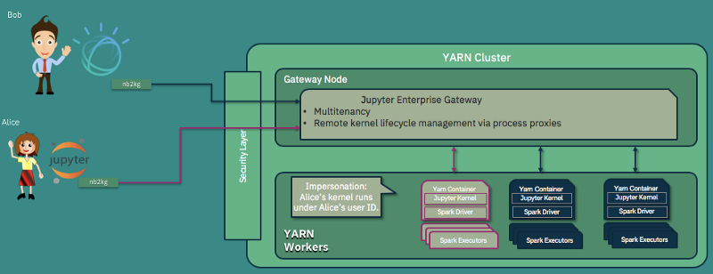

# Jupyter Enterprise Gateway Incorporation

## Problem

Founded in academia, the Jupyter projects provide a rich and highly popular set of applications for
interacting with and iterating on large and complex applications.  It has been truly ground-breaking.
However, when we first attempted to build a Notebook service that could enable a large number of data
scientists to run frequent and large workloads against a large Apache Spark cluster, we identified
several requirements that were not currently available in the Jupyter open source ecosystem. We tried
to use the Jupyter Kernel Gateway project, but we quickly realized that the JKG server became the
bottleneck because the co-located Spark driver application for these kinds of workloads (in this case,
the kernel process running on behalf of notebook cells) were extremely resource intensive. In organizations
with multiple data scientists, you can quickly saturate the compute resources of the Kernel Gateway server.

Jupyter Enterprise Gateway enables Jupyter Notebook to launch and manage remote kernels in a distributed cluster,
including Apache Spark managed by YARN, IBM Spectrum Conductor or Kubernetes. New platforms can be added via an
extensibility layer that would handle specific capabilities of the underlying cluster manager.

## Proposed Enhancement

The incubating [Jupyter Enterprise Gateway project](https://github.com/jupyter-incubator/enterprise_gateway) has
matured to the point where it addresses the issues noted above, and others. It should be considered for incorporation
into the main Jupyter organization as an official Subproject.

## Detailed Explanation

Please see below detailed project information.

### Current and Potential Use Cases

* Provision and manage kernels in a remote cluster.
* Support kernels to be launched as a given user enabling multi-tenancy.

### Current Features

Jupyter Enterprise Gateway is a web server that provides headless access to Jupyter kernels within
an enterprise.  Built directly upon Jupyter Kernel Gateway, Jupyter Enterprise Gateway leverages all
of the Kernel Gateway functionality in addition to the following:

* Adds support for remote kernels hosted throughout the enterprise where kernels can be launched in
the following ways:
    * Local to the Enterprise Gateway server (today's Kernel Gateway behavior)
    * On specific nodes of the cluster utilizing a round-robin algorithm
    * On nodes identified by an associated resource manager
* Provides support Apache Spark managed by YARN, IBM Spectrum Conductor or Kubernetes out of the box.
Others can be configured via Enterprise Gateway's extensible framework.
* Secure communication from the client, through the Enterprise Gateway server, to the kernels
* Multi-tenant capabilities
* Ability to associate profiles consisting of configuration settings to a kernel for a given user
* Persistent kernel sessions

Below are some more details on the supported cluster platforms and specific capabilities:

#### Distributed Kernels in Apache Spark

Jupyter Enterprise Gateway enables Jupyter Notebook to launch and manage remote kernels in a distributed cluster. It
leverages different resource managers to enable distributed kernels in Apache Spark clusters. One example shown below
describes kernels being launched in YARN cluster mode across all nodes of a cluster.

Note that, Jupyter Enterprise Gateway also provides some other value added capabilities such as : enhanced security and multiuser support with user impersonation.

#### Distributed Kernels in Kubernetes

Jupyter Enterprise Gateway support for Kubernetes enables decoupling the Jupyter Notebook Server and its kernels into multiple pods. This enables running Notebook server pods with minimally necessary resources based on the workload being processed.

## Criteria for Incorporation

### Have an active developer community that offers a sustainable model for future development.

The enterprise gateway reuses and extends classes from the Jupyter `kernel_gateway` and `notebook` Python package. By virtue of this implementation, it is largely sustained by development of the `jupyter/notebook` project. Minimal maintenance is required to ensure the enterprise gateway codebase continues to interoperate with future releases of the `notebook` package.

### Have an active user community.

Enterprise gateway is a fundamental component in multiple IBM Cloud offerings, and has also been adopted in a few large companies that are providing Analytical and/or AI platform for it's internal/external customers.

Other then that, below are some stats that have been collected from the Jupyter Enterprise Gateway GitHub repository from October 14th 2017 - current:

- 7 releases
- 10 contributors
- 5 different organizations (based on current employment)
- 205 commits (16,551 additions, 9,616 removals)
- 60 Stars
- 26 Forks
- 10K+ pulls of primary docker image

### Use solid software engineering with documentation and tests hosted with appropriate technologies.

The Enterprise Gateway has a suite of unit and integration tests that are run automatically on Travis on every PR and any commits to master.

The Jupyter Enterprise Gateway community provides multiple resources that both users and contributors can use:

- Source Code available at GitHub: https://github.com/jupyter-incubator/enterprise_gateway
- Documentation available at ReadTheDocs: http://jupyter-enterprise-gateway.readthedocs.io/en/latest/
- Automated builds available at Travis.CI: https://travis-ci.org/jupyter-incubator/enterprise_gateway
- Releases available at PyPi.org: https://pypi.org/project/jupyter_enterprise_gateway/
- Releases available at Conda Forge: https://github.com/conda-forge/jupyter_enterprise_gateway-feedstock
- Related Docker Images available at Elyra organization at DockerHub: https://hub.docker.com/u/elyra/dashboard/

### Demonstrate continued growth and development.

Since entering incubation, the Jupyter Enterprise Gateway have added several new code contributors, performed 7 releases, and added support for two new resource managers - including support for Kubernetes. The community has also seen a recent increase on issues/questions submitted to the project, which implies more users are interested in, and deploying, Enterprise Gateway.

In addition, we believe that by building upon the existing Jupyter stack, a majority of the necessary changes on Enterprise Gateway will be in the area of adding/maintaining support for resource managers (i.e., process proxy implementations).  As a result Enterprise Gateway should continue to maintain compatibility/interoperability with new versions of Notebook components with little or no effort.

### Integrate well with other official subprojects.

The Enterprise Gateway is a `jupyter/jupyter_core#Application` that uses programmatic APIs from `jupyter/notebook`, `jupyter/jupyter_client` and `jupyter/kernel_gateway` to enable communication with Jupyter kernels like `ipython/ipykernel`. By definition, it integrates with other official Subprojects.

We are also looking for investigating deep integration with `JupyterHub` to decouple the kernel instances into specific pods in a kubernetes environment.

### Be developed according to the Jupyter governance and contribution model.

The Enterprise Gateway is in the Jupyter Incubator, and under the Jupyter governance and contribution model since its inception.

### Have a well-defined scope.

Jupyter Enterprise Gateway enables Jupyter Notebook to launch remote kernels in a distributed cluster, including Apache Spark managed by YARN, IBM Spectrum Conductor or Kubernetes.

### Be packaged using appropriate technologies such as pip, conda, npm, bower, docker, etc.

The Enterprise Gateway is packaged using setup tools, released in both source and wheel format on PyPI, and installable using `pip`.  It is also available in conda forge.

## Pros and Cons

Pro: Extend Jupyter Stack to support distributed/remote Kernels

Pro: The runtime can easily be extensible to support new cluster resource managers

Con: Still requires couple extensions (e.g. NB2KG) to connect to the gateway

## Interested Contributors

@parente, @rgbkrk
