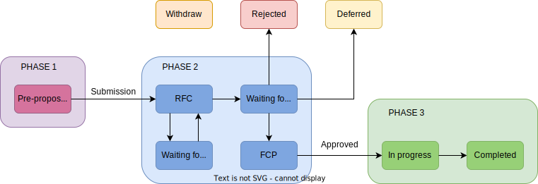

# Jupyter Enhancement Proposal

## Background

Project Jupyter has an existing repository and process for “Jupyter Enhancement Proposals” or JEP for short. The repository is here:

<https://github.com/jupyter/enhancement-proposals>

This format was originally used by [IPython (IPEP)](https://github.com/ipython/ipython/wiki/IPEPs:-IPython-Enhancement-Proposals) and continues to be used by the [Python Core language (PEP)](https://www.python.org/dev/peps/). As currently envisioned, JEPs are written documents, in the form of a Pull Request to this repo, which describes significant proposed units of work on the projects. The README of the repo summarizes this as:

“Jupyter Enhancement Proposals will be used when presenting changes or additions that affect multiple components of the Jupyter ecosystem OR changes to a single key component.”

Since the JEP process was created, Jupyter has grown in the number of users, diversity of usage cases, number of contributors, and number of repos/org. For a variety of reasons, the JEP process has not scaled with this growth. The current situation is characterized by:

1. Given the scope of development, it is difficult to follow all of the activity;
2. As a result, most decisions are made in a distributed manner by local teams of contributors working on particular repos and orgs (hub, lab, ipython, jupyter-widgets, etc.); as a consequence:
3. Distributed decisions that affect the project as a whole are made, without all relevant parties being able to participate and contribute.
4. This is leading to fragmentation and slow progress in project wide concerns, such as the core protocols and standards of Jupyter.

As a result, there is a need to revitalize and reorganize an efficient and robust centralized proposal and decision making process for major work units across the project.

## Goals and Tenets

Project Jupyter has adopted the Jupyter Enhancement Proposal process (JEP) to address distributed collaboration and experimentation as the project scales in the dimensions of contributors, components, and lines of code.  At a high level, the primary guiding principle of the JEP process is to encourage collaboration and discussion as early as possible in the lifecycle of a major proposed change in Jupyter, with the goal of preventing costly rework, competing ideas, and unnecessary forking or fragmentation of ideas.

Several sub-goals exist for this process:

- **Maximize success of large proposals** that get stalled in the wrong venue (e.g. a single PR comment thread)
- Provide a **better alternative to “piecemeal” development** where multiple PRs to build an end-to-end set of functionality are split across multiple GitHub project without broad consensus, context, or guidance.
- Provide a **clear, time-limited, and authoritative process for work proposals**, to facilitate funding conversations.  (e.g. provide a concrete artifact to reference in a grant proposal, roadmap item, etc.)
- Provide a **consolidated “stream” of all proposals across the entire Jupyter community** that contributors of all levels can monitor and selectively engage in.

With that in mind, the JEP process operates under the following tenets:

- **The JEP process is intended for proposed changes of non-trivial scope.**  “Non-trivial” is addressed below in the “JEP / Not-a-JEP Rubric” of this document.  If proposals that go through the JEP process do not receive the benefits listed above, the JEP process should be amended to better scope what applied.

- **The JEP process naturally complements the PR process, but does not replace it.**  A thoroughly-reviewed and approved JEP is a valuable reference during a PR to reduce friction, reduce time-consuming context sharing, and encapsulate decisions and other discussions.  Moving a premature PR into a JEP should be a lightweight process that doesn’t cause friction for the contributor.

  - GitHub issue and PR templates, for example, across the entire Jupyter project, should have references to the JEP process as a possible outcome of a given PR.

- **There is one JEP repository, all Jupyter-governed projects must use it.**  To facilitate the easiest possible adoption and high visibility of ideas, a single JEP repository will be used.  Even if a JEP only applies to a single organization.

- The JEP process **has multiple valid use cases**.  Each use case might have a slightly different expected workflow or base JEP template.  Some expected use cases include:

  - Non-trivial feature proposals within a single component that would benefit from process.  (e.g., a non-trivial change to JupyterLab that would benefit from formal process within the JupyterLab project)
  - Non-trivial features or improvements that span multiple projects.
  - Any proposed changes to published APIs or core specifications (e.g., nbformat)
  - Changes to the JEP process itself.
  - Creating a new official GitHub organization.

## JEP Submission Workflow

### Phase 1: Pre-proposal

This is the least formal stage of any jupyter enhancement proposals. During this phase, discussions on the mailing list, in-person, on github issues are all fine to gauge community interest, feasibility, consequences, and to scope out technical impact and implementation details.

In order to transition out of the pre-proposal stage, the following checklist must be complete:

1. A github issue on the Jupyter Enhancement Proposals repo is created that
2. 1. Briefly outlines the proposal

2. Suggests reviewers (optional) in addition to the SSC members.

   3. Why it should be a JEP

   4. 1. See the “JEP / Not-a-JEP Rubric” below.
3. A *Shepherd* is identified to see the process through. Shepherds are assigned from a set of people actively involved in the project (Software subprojects, SSC or EC, Standing committees and Working groups), based on the scope of the JEP. The Shepherd can be the author of the JEP. If the author of the JEP cannot
identify a Shepherd, the SSC is responsible for designating one.
4. A number is assigned to the JEP to track it through the rest of the process.

Outcome:

The Shepherd decides if the JEP criteria have been met.

- *It's a JEP!* Please create a new PR with the JEP contents using template X.  On that basis, you can resolve this issue unless you have further questions.*
- *It’s not a JEP*. (Provide reasons and close the issue.)

### Phase 2: RFC for the JEP

Submission: The author submits an initial draft of the JEP as a PR to the JEP repository starting from the relevant template decided in the pre-proposal stage. The number assigned to the PR by GitHub is the JEP number. The Shepherd optionally assigns reviewers in addition to the SSC. Reviewers and the SSC are referred as the Review Team in the following.

Request For Comment (RFC) phase: The proposal is iterated on with feedback from the Review Team and the community at large. The Shepherd helps engage the Review Team. When the proposal matures, if there are no major objections, the Shepherd calls to a vote from the SSC members.

Waiting Decision (WD) phase: The vote follows the rules described in the Decision-Making Guide of the Jupyter Governance. The SSC members have seven days to vote, although the council may consider longer voting periods. If the vote results in an acceptation of the JEP, the Shepherd initiates the Final Comment Period. Otherwise the JEP is considered as rejected.

Final Comment Period (FCP): The community at large has 10 calendar days in which to provide any final comments on the JEP. A JEP may revert back to RFC if objections are supported by the Review Team. If not reverted to the RFC phase, the JEP is approved at the end of the FCP.

### Phase 3: Work Commences

Once a JEP has been merged into the jupyter/enhancement-proposal repository, it becomes active and development work can commence on the JEP. As the implementer(s) is submitting a pull request or pull requests in relation to the JEP, they should provide a reference to the JEP so that reviewer has background context on the JEP.

As the JEP is being implemented, the implementer(s) are submitting pull requests for the JEP, they should update the JEP with addendums to denote the progress of the implementation using the following stages.

1. In progress implementation via (list of PRs).
2. Fully implemented via (list of PRs).

If in the course of implementation, it is discovered that the implementation needs to be radically different from what was defined in the original JEP, then a pull request needs to be submitted to modify the original JEP with the new necessary implementation and a note citing the need for a modification to the JEP. This pull request should be re-approved by the original review team.

If in the course of the implementation, the implementer(s) can choose to withdraw from the original JEP if they are no longer interested in implementing the JEP or see infeasibilities in the JEP.

### Updating an accepted JEP

When one needs to amend a JEP that was merged, they need to open a new JEP. If the new JEP gets accepted and merged, the old JEP loses its "Active" status; a note should be added to the old JEP with a link to the one it is replaced with.

### Paths of the status of JEPs

- Pre-proposal: first stage of the JEP
- RFC: Request For Comments, proposal is under active discussion and revision
- Waiting for answer: authors have been pinged and we will wait 2 weeks before revising the status
- Waiting for decision: final decision to approve or not to be sanctioned by SSC
- FCP: Final Comment Period, 10 days period for any final comment before approval
- In progress: JEP has been approved, implementation is in progress
- Completed: Implementation has completed
- Withdrawn: at any stage the author can decide to withdraw the JEP
- Deferred: Inactive draft that may be taken up again at a later time
- Rejected: The JEP has been rejected and will not be implemented

## What qualifies as a JEP?

This section contains a set of principles to help determine when something is a JEP. The principles will be used to determine when something becomes a PR during the JEP pre-proposal stage, as well as to determine when a PR becomes a JEP at an individual repo level.

**Principles to follow**

Below are a few example guidelines to follow when deciding if an idea should include
a JEP (If yes, it requires a JEP). Under each question is a relevant example proposal.

- Does the proposal/implementation require PRs across multiple orgs?
  - Defining a unique cell identifier
- Does the proposal/implementation PR impact multiple orgs, or have widespread community impact?
  - Updating nbformat
- Does the proposal/implementation impact the interoperability of software components developed in separate Jupyter Subprojects?
  - Defining a unique cell identifier
  - Deferred kernel startup
- Does the proposal/implementation create a new concept that will impact multiple repositories?
  - Sandboxed cell outputs
- Does the proposal involve creating a new GitHub organization or subproject?
  - jupyter-xeus

## Distribution

This section describes how information about the JEP process (e.g., new JEPs, updates to
current JEPs, etc) is communicated to the community.

Note: This JEP repo is the **canonical "source of truth"** for individual JEPs, the JEP process, and activity on JEPs.

### The JEP public archive website

A public website contains a readable archive of all JEP proposals.
It contains list of all JEPs that have entered a "final" state
(e.g., "Completed", "Withdrawn", "Rejected"). The content of each JEP will
be displayed in a readable fashion. When a JEP enters into a final state, it
is added to this website.

Note that the JEPs themselves contain the content, while the website is just a
quick way to display them in a reading-friendly format.

