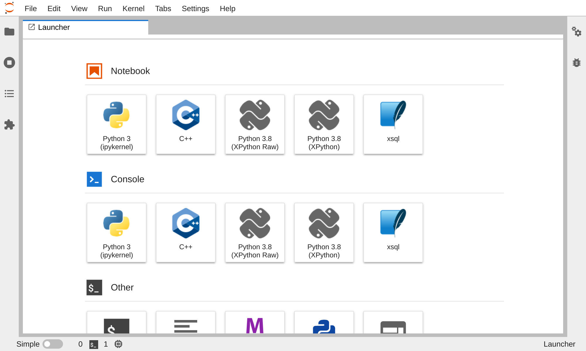
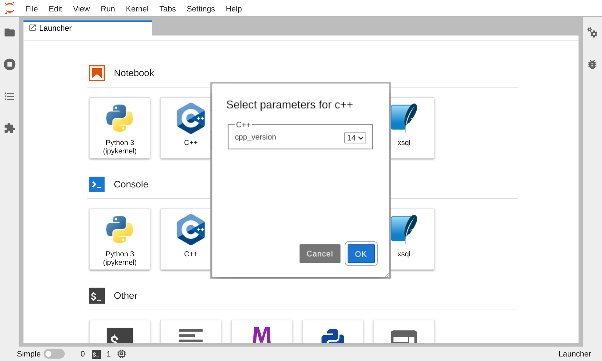
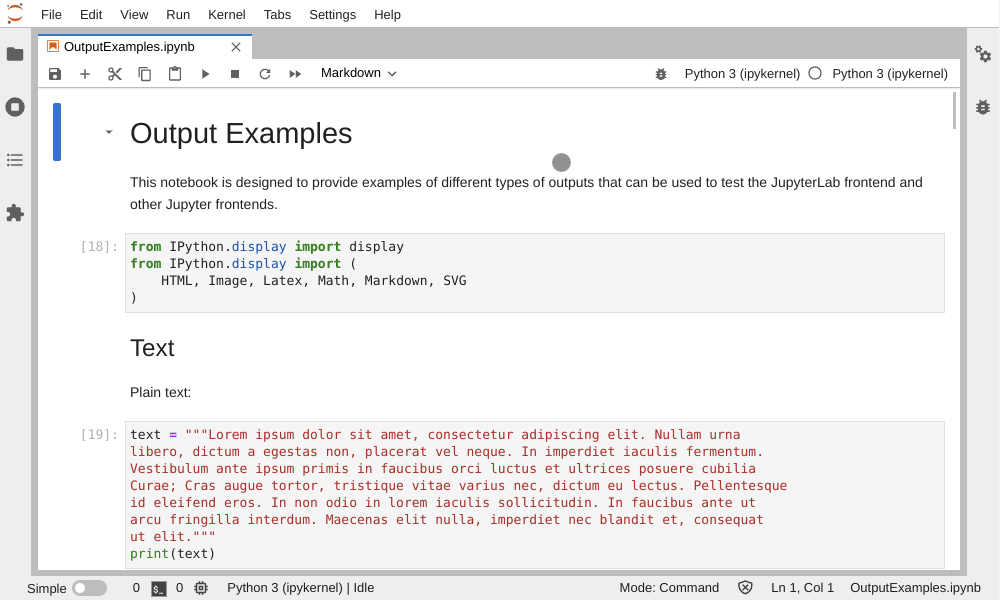

# Jupyter Parameterized Kernel Specs

## Problem

When creating a new kernel, we need to define a different "specs" file for each possible parameter combination used by the executable. For example, the xeus-cling kernel supports three different versions of the `C++` language, `C++11`, `C++14`, and `C++17`, which is specified by the `--std` command-line option.

When installing xeus-cling, we install three almost identical kernel specs. The only difference is the last parameter of the execution command `--std=c++X`.

When more than one parameter is available, the number of possible combinations grows in a combinatorics fashion.

Besides, some kernels would benefit from being configurable when launching them. For example, the connection information to the database could be specified through kernel parameters rather than kernel magics.

Sometimes when installing multiple kernels, the JupyterLab launcher panel is crowded with too many options to create a notebook or console with a specific kernel. The kernels that users see in the launcher are just multiple kernel specs for one kernel. We could avoid having that many kernels displayed, adding parameters to the kernel specs, showing only one option per kernel, and offering a modal dialog with the different options the user can choose from when selecting a specific kernel.

## Proposed Enhancement

The solution we are proposing consists of adding parameters to the kernel specs file in the form of a JSON Schema that would be added to the specs metadata. These parameters are then used to populate the `argv` and `env` lists (respectively the command-line arguments and environment variables).

Upon starting a new kernel instance, a front-end form generated from the JSON schema is prompted to the user to fill the parameter values. Many tools are available to generate such forms, such as react-jsonschema-form.

Some of the chosen parameter values can be saved in e.g. the notebook metadata so that they don't have to be specified every time one opens the notebook.

## Detailed Explanation

As described in previous sections, we propose to parameterize the kernel specs file. In the example shown below, we can see the kernel specs file from the kernel xeus-cling. We suggest changing the last parameter of the execution command `-std=c++11` to have a variable `-std=${parameters.cpp_version}` and adding a new object `parameters` to the metadata of the kernel specs.
 
```=json
{
  "display_name": "C++11",
  "argv": [
      "/home/user/micromamba/envs/kernel_spec/bin/xcpp",
      "-f",
      "{connection_file}",
      "-std=c++11"
  ],
  env: [
    "XEUS_LOGLEVEL=ERROR"
  ],
  "language": "C++11"
}
```
```=json
{
  "display_name": "C++",
  "argv": [
      "/home/user/micromamba/envs/kernel_spec/bin/xcpp",
      "-f",
      "{connection_file}",
      "-std={parameters.cpp_version}"
  ],
  env: [
    "XEUS_LOGLEVEL={parameters.xeus_log_level}"
  ],
  "language": "C++"
  "metadata": {
    "parameters": {
      "cpp_version": {
        "type": "string",
        "default": "C++14",
        "enum": ["C++11", "C++14", "C++17"],
        "save": true
      },
      "xeus_log_level": {
        "type": "string",
        "default": "ERROR",
        "enum": ["TRACE", "DEBUG", "INFO", "WARN", "ERROR", "FATAL"],
        "save": true
      }
    }
  },
}
```

The JSON schema specification is augmented with a new `save` attribute used to specify whether the parameter is to be saved in e.g. the notebook metadata for future runs.

Note: Using the JSON Schema, we can automate how front-end forms are created directly from the parameters allowing kernels' authors to decide which parameters are necessary and how to validate them. (Note that JupyterLab already makes use of react-jsonschema-form in other parts of its UI).

In the following screenshots, you can see a small demo of how we envision the UI changes in JupyterLab.

  Jupyterlab Launcher      |  Select c++ version
:-------------------------:|:-------------------------:
   |  





## Pros and Cons

Pros:

 - A less crowded list of kernels specs

Cons:

 - Changes are required in multiple components of the stack, from the protocol specification to the front-end.
 - Unless we require default values for all parameters, this would be a backward-incompatible change.
