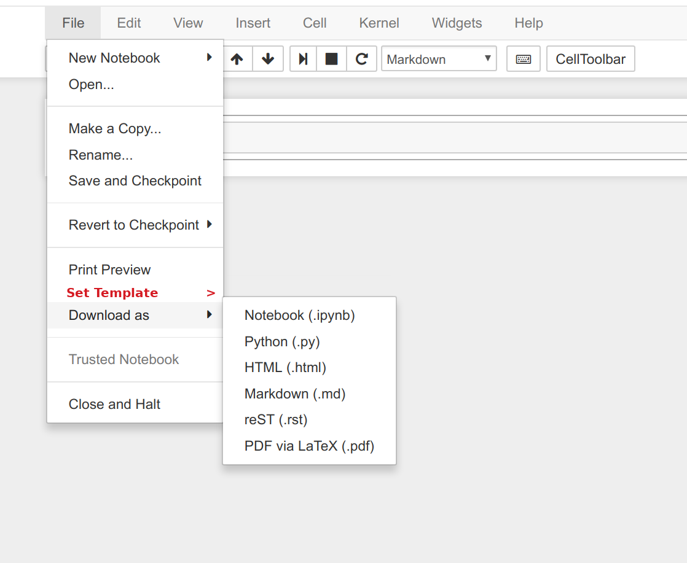

# Jupyter Template as Metadata

## Problem

[nbconvert](http://nbconvert.readthedocs.io/) supports [custom templates](http://nbconvert.readthedocs.io/en/latest/customizing.html#Custom-Templates),
but there is no way to save a custom template as the default template for a Jupyter Notebook,
something that would help with the reproducibility of converted documents
and facilitate the cases illustrate below.

### Case 1: Internal Reports

A team working at company X uses Jupyter Notebook at work
and need to generate a weekly report.
The reports **must** be branded with the company logo at the first page upper right corner.
The report release staff whish to click on `File > Download as > PDF via LaTeX (.pdf)`
and get the file they need to circulate
**but** they need to run nbconvert from the command line.

### Case 2: Meetup Supplement Material

A data science [Meetup](https://www.meetup.com/) group meet weekly
and each meeting someone present something
and provide a Jupyter Notebook as supplement material.
The group want to provide the supplement material at their website
with a end note advertising the group.
The group website master whish to click on `File > Download as > HTML (.html)`
and the file with the end note
**but** they need to run nbconvert from the command line.

### Other cases

Academic journals and conference proceedings are two other cases that could benefit of this enhancement.

## Proposed Enhancement

[Notebook metadata](http://nbformat.readthedocs.io/en/latest/format_description.html#notebook-metadata)
will have a key `template` which value will be a dictionary
to store the location of the default custom template to be used by nbconvert.

## Detailed Explanation

### Notebook Metadata

`template` will be a defined notebook metadata key that will have as value something like

~~~
{
  "html": "path/to/html/custom/template",
  "md": "path/to/markdown/custom/template",
  "rst": "path/to/rest/custom/template",
  "pdf": "path/to/pdf/custom/template",
  "py": "path/to/python/custom/template",
  "r": "path/to/r/custom/template",
  "jl": "path/to/julia/custom/template"
}
~~~  

No key inside `template`-value is required.

The path to the template can be

- a full path (in Unix-like format) to the local filesystem
- a relative path (in Unix-like format) to the local filesystem
- a online address with the protocol specified

### nbconvert behavior

nbconvert will first try to use the custom template provided during the command line call
following back to the custom template specified in the notebook metadata to be converted
and as a last resource using the default template provided by the Jupyter project.

### Jupyter Notebook Web Interface

Jupyter Notebook will provide a option at menu bar
for users set up the custom template they want to associate with the notebook.
For example,

## Pros and Cons

* Pro: Enable users to download the Notebook with a custom format
* Pro: Make the custom template feature more visible
* Con: Increase the number of options at the menu

## Interested Contributors

@rgaiacs