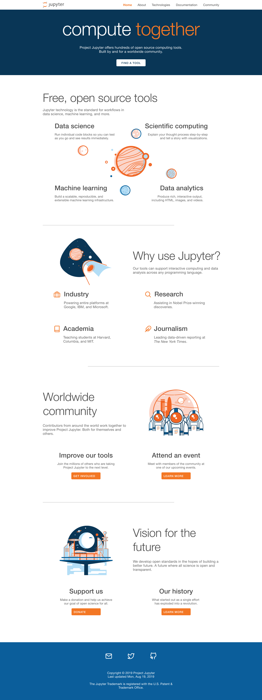
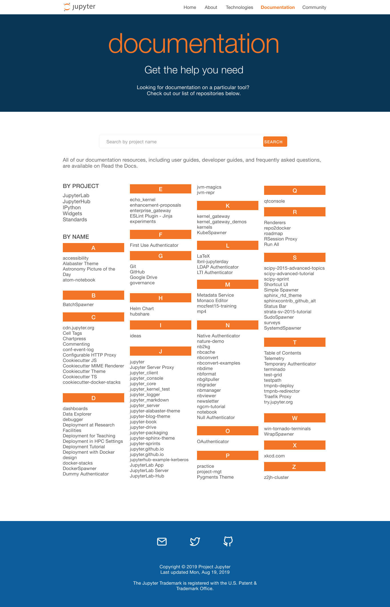
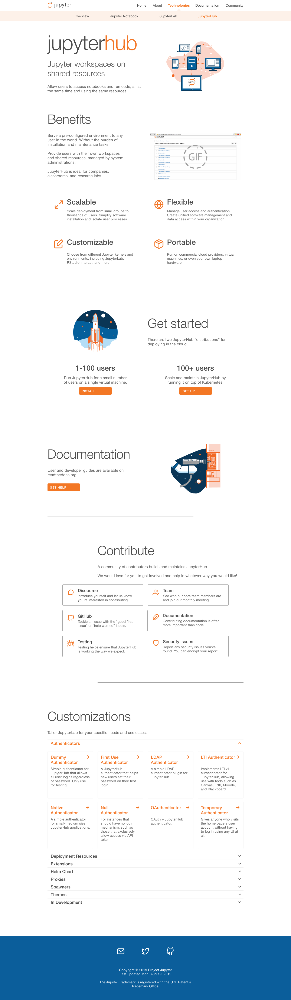
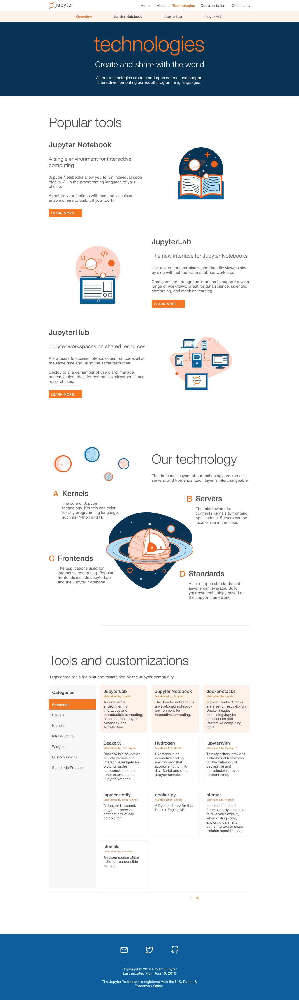

# Jupyter Website Re-Design Implementation Process. 

| Item       | Value                                                                                                                        |
|------------|------------------------------------------------------------------------------------------------------------------------------|
| JEP Number | 10                                                                                                                           |
| Title      | Jupyter Website Re-Design Implementation Process.                                                                            |
| Authors    | Tim George [@tgeorgeux](https://github.com/tgeorgeux) |
| Status     | Draft                                                                                                                        |
| Created    | 7 May, 2020                                                                                                            |
| History    | 7 May, 2020                                                                                         |
## Problem
Technical: The existing Jupyter Website is a mix of Jekyll templates and bespoke hand-crafted Javascript. Over time the templates have experienced bit-rot and the website is difficult to update significantly without breaking it. 

Design: The design of the existing Jupyter Website is dated, and doesn't reflect the complexity of the existing organization, nor does it help outsiders onboard to Jupyter's software or community sufficiently. 

## Proposed Enhancement
Over the summer of 2019 a team from UCI performed research then designed a new website including an MVP set of pages, templates for future pages, and a style guide for components. 

I propose we use this design work as a template for a new Jupyter.org website using a stable static website generator, with a few hard-hitting interactive elements to help users discover Jupyter Projects that would be useful to them. I propose we use Gatsby.js to generate pages via a markdown converter, this will allow us to seemlessly integrate with the moreinteractive elements.

## Detailed Explanation
### Design details
The design of this new website is finished and be viewed [here](https://www.figma.com/proto/PQD2GrejGoeZdYGhXthnAuEs/jupyter_master?node-id=1804%3A10&viewport=-61%2C345%2C0.10204222798347473&scaling=min-zoom).

Here's some screenshots of the design:

### Development details
Development is the next step. We need a static site generator. (@marwahaha made an initial [prototype](https://guarded-sands-77993.herokuapp.com/)) There is (at least) one custom component in the current design that requires some custom Javascript. Preferably, we could write such components using a well-known framework like ReactJS.

I propose we use [GatsbyJS](https://www.gatsbyjs.org/) to achieve this. 
* Gatsby is a simple framework based on ReactJS. We can leverage existing GatsBy templates for the basic structure of the website.
* Website content will be written in Markdown and parsed using Gatsby's [`gatsby-transformer-remark`](https://www.gatsbyjs.org/packages/gatsby-transformer-remark/) native plugin. 
    * Jupyter projects maintain a markdown page.
    * Content is submitted via pull requests. 
    * We'll provide a specific editorial guideline and rubric for content submission and review.
* Since Gatsby is based on ReactJS, we can easily create custom React components—like the pivot table for Jupyter projects in our current design.
### Implementation

There is decent amount of developer time needed up front. This will pay-off in the long run as the maintenance cost is low after initial development. 

Approach to rallying developer time+efforts:
* We will need an individual or committee to commit to pushing forward on this.
* We will need expertise in the following areas: Design, Technical, and Content
* I (Tim George) am happy to serve as a single 'champion' of this project or on a comittee with a technical and content expert.
## Pros

- Website Design
    - Explains the 'what Jupyter is' narative.
    - Serves to offer the community different types of engagement
        - History, events, software, community, Governance, notable contributors.
    - It really is a killer design.
        - And cool illustrations.
- Low maintenance cost in the long run.
    -  Up to date with modern web development standards.
    -  Design is made to scale up.
    -  Gives rubric for incoming PRs.
## Cons
- High development demand up front
    - There's a bit of a chicken-egg problem here, it's hard to get commitment on a large enough scale to complete this work without explicit agreement this is the direction to go.
