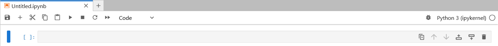
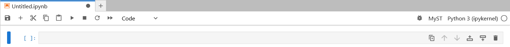

## Summary

This adopts the same design used for code cells to text cells, allowing Jupyter to support authors preference for different markup languages and flavors.

## Motivation

Jupyter Notebooks are used for academic writing that require features not included in the [original Markdown specification by John Gruber](https://daringfireball.net/projects/markdown/) neither the "standard, unambiguous" Markdown flavour called [CommonMark](https://commonmark.org/). One example of such a feature is cross-reference. Because of this, new flavours of Markdown such as Markedly Structured Text ([MyST]) and [Quarto] were developed. Unfortunately, Jupyter Notebook creators have no way to declare which markup languages and flavors they will be using. This generaly end with users having a bad experience. By allowing Jupyter Notebook creators to declare the markup language and flavor the same way they declare the kernel, the application used to read or edit the Jupyter Notebook (in the rest of this document referenced as *the IDE*) will be able to provide a better user experience.

## Guide-level explanation

Every Jupyter Notebook has one and only one kernel. When using Jupyter Lab reference implementation, users can select at the top right one kernel among the availables in the server for their notebook.



This enhancement proposal adds the option for users to select a markup language.



Support to markup languages are implemented by *the IDE*. If *the IDE* does not support the markup language used in a Jupyter Notebook, *the IDE* must warning the user the first time a change is attempted. In the case of Jupyter Lab, support to markup languages can be implemented using the already existing extension protocol. For example, users would be able to select one of

- `CommonMark`, the Markdown flavor officially supported and powered by marked.js.
- `GitHub Flavored Markdown`, that would convert `@username` to `https://github.com/username`.
- `GitLab Flavored Markdown`, that would convert `@username` to `https://gitlab.com/username`.
- `Quarto`, that would convert `@knuth` to `Knuth 1984` and append the `Knuth, Donald E. 1984. “Literate Programming.” The Computer Journal 27 (2): 97–111.` at the end of the cell text.
- `MyST`, that would convert `[](doi.org/10.1093/comjnl/27.2.97)` to `Knuth 1984` and append the `Knuth, Donald E. 1984. “Literate Programming.” The Computer Journal 27 (2): 97–111.` at the end of the cell text.

The details of the implementation of how the text provided by the user is converted to display is left to *the IDE*. *The IDE*  might select different strategies to convert the text provided by the user to display to different languages. For example, `CommonMark` can be converted in the user webbrowser and `Quarto` can be converted by the Jupyter kernel.

To accomodate the proposed new architecture, this enhancement proposal also introduces a new "Markup" cell to be use instead of the existing Markdown cell. The new "Markup" cell is based on the existing Code cell and include the source and the output.

## Reference-level explanation

### Markup info

A new key `markup_info` is introduced to the Jupyter Notebook metadata.

```json
{
    "metadata": {
        "kernel_info": {
            # if kernel_info is defined, its name field is required.
            "name": "the name of the kernel"
        },
        "language_info": {
            # if language_info is defined, its name field is required.
            "name": "the programming language of the kernel",
            "version": "the version of the language",
            "codemirror_mode": "The name of the codemirror mode to use [optional]",
        },
        "markup_info": {
            # if markup_info is defined, its name field is required.
            "name": "the markup language of the kernel",
            "version": "the version of the markup language",
            "enabled_extensions": [
                "name of extension to enable",
                "name of extension to enable"
            ],
            "disabled_extensions": [
                "name of extension to disable",
                "name of extension to disable"
            ],
            "authoring_extension": "name of the IDE extension used to process the cell"
        },
    },
    # the nbformat was increased
    "nbformat": 5,
    "nbformat_minor": 0,
    "cells": [
        # list of cell dictionaries
    ],
}
```

#### Examples

A existing Jupyter Notebook version 4 adopts the CommonMark flavour by default:

```
"markup_info": {
    "name": "CommonMark",
    "version": "0.31.2",
    "authoring_extension": "marked.js"
}
```

A Jupyter Notebook using [MyST]:

```
"markup_info": {
    "name": "MyST",
    "version": "1.8.0",
    "authoring_extension": "mystmd"
}
```

A Jupyter Notebook using Pandoc:

```
"markup_info": {
    "name": "Pandoc",
    "version": "3.8.3",
    "enabled_extensions": [
        "footnotes"
    ],
    "disabled_extensions": [
        "pipe_tables"
    ],
    "authoring_extension": "pandoc"
},
```

### Markup cell

A new cell type `markup` is introduced. It has a field `source` where the user input is stored and a field `outputs` where different output formats are stored as a dictionary.

```json
{
    "cell_type": "markup",
    "source": "[some multi-line markup]",
    "outputs": {
        "text/plain": "[multiline plain text output]",
        "text/html": "[multiline html text output]",
    }
}
```

#### Examples

A small example of CommonMark where user input is converted into HTML and plain text.

```json
{
    "cell_type": "markup",
    "source": [
        "# Lorem ipsum\n",
        "\n",
        "**Lorem** ipsum."
    ],
    "outputs": {
        "text/plain": [
            "# Lorem ipsum\n",
            "\n",
            "**Lorem** ipsum."
        ],
        "text/html": [
            "<h1 id=\"lorem-ipsum\">Lorem ipsum</h1>\n",
            "<p><strong>Lorem</strong> ipsum.</p>"
        ],
    }
}
```

A small example of MyST where user input is converted into HTML and plain text.

```
```json
{
    "cell_type": "markup",
    "source": [
        "# Lorem ipsum\n",
        "\n",
        "Lorem ipsum [](doi.org/10.1093/comjnl/27.2.97)."
    ],
    "outputs": {
        "text/plain": [
            "# Lorem ipsum\n",
            "\n",
            "Lorem ipsum Knuth 1984.\n",
            "\n",
            "Knuth, Donald E. 1984. “Literate Programming.” The Computer Journal 27 (2): 97–111."
        ],
        "text/html": [
            "<h1 id=\"lorem-ipsum\">Lorem ipsum</h1>\n",
            "<p>Lorem ipsum <a href=\"https://doi.org/10.1093/comjnl/27.2.97\">Knuth 1984<\a>.</p>\n",
            "<p>Knuth, Donald E. 1984. “Literate Programming.” The Computer Journal 27 (2): 97–111.<\p>"
        ],
    }
}
```

## Rationale and alternatives

The design choice of this proposal aligns the support of markup languages to the existing mental model that users have of Jupyter kernel and improving the user experience when adopting new markup languages.

The alternative proposal "[Specify the Markdown cell's markdown flavor](https://github.com/jupyter/enhancement-proposals/pull/99)" by Frederic Collonval, Steve Purves and Vincent Vankrunkelsven adds complexity to the mental model for the users as different cells could use different flavor.

The impact of not improve the user experience for new markup languages is the reduction of Jupyter users as they migrate to other tools with a seamless experience.

## Prior art

## Unresolved questions

## Future possibilities

[MyST]: https://mystmd.org/
[Quarto]: https://quarto.org/