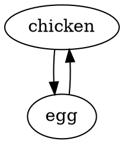
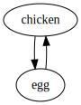
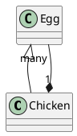
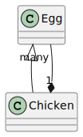

# Summary

This proposal encouraged _Project Jupyter_ to adopt a _text-based diagram_ format in
_Jupyter Markdown_. Easy-to-write diagrams should render consistently, accessibly, and
securely across flagship _Jupyter tools_ like _JupyterLab 4_, _Notebook 7_, _nbconvert_
and _nbviewer_, in addition to the platforms _Project Jupyter_ uses to collaborate, like
_GitHub_, _HackMD_, and _Discourse_. This proposal recommends adoption of
[_MermaidJS_][mermaidjs], with the _fenced code block_ syntax inherited from
_GitHub-flavored Markdown_.

[mermaidjs]: https://github.com/mermaid-js/mermaid

# Motivation

Embedded _text-based diagrams_ within _Jupyter Markdown_ will provide a way to augment
plain- and rich-text narrative when working **in** _Jupyter tools_, as well as **on**
_Jupyter tools_, such as _GitHub_, _Discourse_, _HackMD_, and other common collaboration
platforms.

Beyond Jupyter tools, selecting a widely-adopted implementation and syntax will require
less re-learning of syntax and skills.

# Guide-level explanation

With the addition of [_MermaidJS_][mermaidjs] to _JupyterLab 4_, _Jupyter Notebook 7_,
_Jupyter _, and _Jupyter NBViewer_, _Jupyter_ joins
[GitLab](https://gitlab.com/gitlab-org/gitlab-foss/-/issues/3711),
[HackMD](https://github.com/hedgedoc/react-client/issues/257),
[GitHub](https://github.blog/2022-02-14-include-diagrams-markdown-files-mermaid/) and
[many other platforms](https://mermaid.js.org/ecosystem/integrations.html) in natively
supporting a portable, interoperable _GitHub-Flavored Markdown_ (GFM) syntax for
_text-based diagrams_ to visually describe complex topics.

## What can I draw?

Today, you can start creating the following diagrams in _Jupyter Notebooks_ or _Jupyter
Markdown_ files:

- _Class Diagrams_ that show the relationships between software components
- _Entity Relationship Diagram_ taht show the relationships between data models
- _Flowchart_ that show decision processes
- _Gantt Charts_ that show the relationship between tasks over time
- _Gitgraph (Git) Diagram_ that show the sometimes-bewildering history of complex
  _distributed version control_ operations
- _Mindmaps_ that show the relationship between different ideas
- _Pie Charts_ that show the relative size of different values
- _Requirement Diagrams_ that show the chain of relationships from _what a user needs_
  to _what we should build_
- _Sequence Diagrams_ that show the exchange of information between different people,
  systems, or processes
- _State Diagram_ that show the possible states a system can be in, and how they might
  change
- _Timeline Diagrams_ that show events over time
- _User Journey Diagrams_ that show the cycle of events over time

...and they should _mostly_ render the same way everywhere.

## How do I draw it?

The [MermaidJS Documentation](https://mermaid.js.org/intro/) provides full examples of
all the supported diagram formats. But, mostly, try it out inside your _Jupyter tools_!

## Why _text-based diagrams_?

Unlike diagrams authored in heavyweight drawing programs, or as the output of code,
_text-based diagrams_ are easy to create by hand, and are usually readable when they
_can't_ be rendered fully. This helps _everyone_ understand visual concepts, including
those that make use of _assistive devices_ like _screen readers_. By doing this
rendering right in your browser, your ideas become visual as quickly as possible:
combined with the _Jupyter Collaboration_ features introduced in _JupyterLab 3.1_, and
refined in _JupyterLab 4_, this reactivity can be shared with your whole time.

By choosing this widely-implemented, portable syntax, we hope the all-important _muscle
memory_ mastery developed while working in _Jupyter tools_ are applicable to other
digital platforms, and hopefully will improve the communication of _Project Jupyter_
itself.

## Why _MermaidJS_?

While many other [_text-based diagram_](https://text-to-diagram.com) formats exist,
_MermaidJS_ enjoys:

- broad adoption across many tools and platforms with a consistent syntax
- a relatively simple and readable format
- a wide number of software-oriented and general-purpose diagrams
- runs entirely within the browser

# Reference-level explanation

## _MermaidJS_ Details

_MermaidJS_ is _free software_, distributed under the permissive
[MIT License](https://github.com/mermaid-js/mermaid/blob/develop/LICENSE) and adheres to
a
[code of conduct](https://github.com/mermaid-js/mermaid/blob/develop/CODE_OF_CONDUCT.md).

The codebase has been actively publishing releases since 2014, with over 400 historical
contributors, with a relatively smaller core of active contributors.

The `mermaid` package itself is distributed on
[`npmjs.com`](https://www.npmjs.com/package/mermaid) as well as _content delivery
networks_ (CDN).

At install/run time, aside from its own assets, it entails a net addition of `dagre-d3`
and the full `d3` metapackage. Some advanced features use the `cytoscape` and `elkjs`
_rendering engines_, but are only loaded when needed.

## Unparseable Diagrams

As a _fenced code block_, without broad syntax highlighting support, Jupyter clients
that do not support _MermaidJS_ at all would fall back to the default typography and
color chosen for code content by the client and/or user. As _text-based diagrams_ are
usually written by hand, an unparseable diagram was _at least_ readable to the author at
time of writing, and likely their audience will be able to glean _some_ meaning from the
text itself.

It is therefore recommended that unparseable diagrams be presented as plain code text,
preserving the whitespace of the source document, with an option to see any parser
errors. Ideally, the text would be syntax highlighted, but as noted elsewhere, this is
somewhat non-trivial.

## Misparsed Diagrams

Today, only Jupyter clients that have been extended (by e.g. `jupyterlab-markup`) will
render _MermaidJS_ diagrams with the _fenced code block_ syntax, using whatever version
is currently included in the extension (e.g. `8.14`). Diagrams written for those version
are _very likely_ to continue being parsed by _MermaidJS 10_, but there are certainly
cases where the reverse is not true, as in the case of some of the experimental diagrams
not listed above.

## Alternative Implementations

If a Jupyter client is unable to adopt MermaidJS, but can offer a best-effort,
grammar-compatible implementation that will draw _something_, this is preferable to, but
should not exclude, presenting the diagram as plain text.

## _JupyterLab_ PR #1402

[jupyterlab/jupyterlab#1402](https://github.com/jupyterlab/jupyterlab/pull/14102)
proposes adding `mermaidjs 10` to the default _Markdown_ rendering engine, `marked`. As
_JupyterLab 4_ is the upstream of _Jupyter Notebook 7_, landing this PR would mean only
a few configuration files would have to change.

### Implementation

Implementing `mermaid` with _fenced code blocks_ means _every_ code block is passed
through an extra check for the `mermaid` syntax marker. When found for the first time,
the core `mermaid` bundle (and its transient dependencies) are lazily loaded, and each
extra kind of diagram loads an additional grammar.

This increases the complexity of the implementation a fair amount, and uses
_asynchronous rendering_ more aggressively than was previously used.

### Size

While lazily-loaded, and having no appreciable impact on the _time-to-first
interaction_, these _MermaidJS_ assets are **not small** when installed, or when served
to the browser. The following table compares some relative sizes of the full
distribution of all possible files that _could_ be loaded by a _JupyterLab_ user:

|              | uncompressed (mb) | gzip (mb) |
| :----------- | ----------------: | --------: |
| `4.0.0a46`   |              7.02 |      1.98 |
| `08f4d6e`    |              9.76 |      2.78 |
| only `elkjs` |              1.43 |      0.41 |

> - the _uncompressed_ column is what a user _typically_ sees when loading the
>   application.
> - the _gzip_ column _roughly_ can be seen as the impact on the as-distributed wheel on
>   PyPI

`elkjs` is called out explictly, due to its size. Likely the state-of-the-art in terms
of _auto layout_ tools, it has potential _well_ beyond many other engines for complex
diagrams, but is currently hidden behind an experimental feature flag, almost certainly
not enabled on other platforms. It may be sensible to omit it from the initial
distribution.

### Security

To avoid _cross-site-scripting attacks_, the `marked` API is used with all available
security features, and further applies sanitiziation. Unfortunately, this forces the
delivery of diagrams as base64-encoded
[Data URIs](https://developer.mozilla.org/en-US/docs/Web/HTTP/Basics_of_HTTP/Data_URLs)
as the `src` attribute of `` tags. This means that all interactive _MermaidJS_
features, like hypyerlinks, tooltips, and cross-diagram configurable styling, are
unavailable.

An alternate approach could render these inside restrictive `<iframe>` tags, but
providing even "simple" features like hyperlinks would require a relatively high degree
of further complexity, such as
[`postMessage`](https://developer.mozilla.org/en-US/docs/Web/API/Window/postMessage).

At present, these images _can_ be viewed in a new, anonymous browser tab with _Open
Image in New Tab_, which has no particular security implications. Further, as a
well-formed, self-contained image, these can be copy and pasted into any application
that supports the SVG standard.

### Way Forward

This PR passes the full _JupyterLab_ test suite, and is explicitly waiting on this
proposal.

## nbconvert PR #1957

[jupyter/nbconvert#1957](https://github.com/jupyter/nbconvert/pull/1957) follows the
pattern of MathJax, downloading the _MermaidJS_ assets from a CDN, but making this value
configurable. The `mistune` grammar's handling of \_venced

### Implementation

The implementation is not particularly complex.

### Security

This implementation uses the _inline HTML_ integration with the mermaid API. This means
it replaces `<div class="mermaid">` tags with a full `<svg>` tag.

This enables some more features, but might have further security considerations.

### Way Forward

This PR is still relatively early in the process, but is mostly complete. It does not
yet handle the case of not loading the `mermaid` assets if and only if a mermaid `div`
is found. This would need to be improved.

# Rationale and alternatives

This proposal is focused on _text-based diagrams_ written in a _text editor_, as opposed
to _image-based diagrams_, authored in purpose-built applications, or _data-driven
diagrams_, often generated by code.

## ASCII Art

The simplest _text-based diagrams_, colloquially known as _ASCII art_, are presented
typographically and require no rendering beyond a row/column grid of monospaced text.

This syntax is _still_ supported in _Markdown_, even by the "reference" _Markdown_
implementation, and can be considered the _do nothing_ alternative.

**Syntax**

    +---------+         /---\
    |         | -----> /     \
    | chicken |        | egg |
    |         | <----- |     |
    +---------+         \---/

**Output**

> _Nothing to see!_

**Pro**

- effective at a small scale (e.g. 80x25, the dimension of a _punch card_)
- require no software

**Con**

- puts the burden of content and _diagram layout_ on the author
- puts the _interpetation_ of these diagrams on the reader
- no formal specification exists
- very whitespace-driven, makes _comparison of history_ over time challenging

## graphviz

In 1991, [`graphviz`](https://gitlab.com/graphviz), released by AT&T Bell Research Labs,
codified the "good parts" of _ASCII art_ diagrams (e.g. arrows that could be read as
arrows) but lifted the burden of _diagram layout_, with an _auto layout_ algorithm.

**Syntax**



**Output**



**Pro**

- has several well-known file extensions and a
  [MIME type](https://www.iana.org/assignments/media-types/text/vnd.graphviz)
- robust implementations exist for both the server and the browser (via WebAssembly)
- a single, well-defined, very lenient grammar
- not white-space sensitive
- good out-of-the-box layout rules, with the ability to override many features
- supports features like hyperlinks and a subsets of HTML, including hyperlinks and
  tables
- widely generated and consumed within the scientific computing ecosystem, such as by
  [networkx](https://networkx.org/documentation/stable/reference/generated/networkx.drawing.nx_pydot.graphviz_layout.html),
  [pygments](https://pygments.org/docs/lexers/#lexer-for-the-dot-language-graphviz), and
  [pyreverse](https://pylint.readthedocs.io/en/latest/pyreverse.html)
- used on many jupyter projects
- scale to _reasonably_ large numbers of nodes and edges

**Con**

- historically difficult to install on some platforms
- not broadly implemented as a _Markdown_-embedded authoring tool
  - with some notable exceptions such as _HackMD_, and some _JupyterLab extensions_
- unlikely to add new features

## PlantUML

In 2009, [PlantUML](https://plantuml.com) took some of the concepts from `graphviz`,
extending them for the conventions of the so-called
[Unified Modeling Language](https://www.uml.org/), which prescribes a selected number of
canonical views, which continue to be used in software.

Unlike many, heavyweight visual UML tools, this offered a relatively terse, _version
control_-friendly format both for authoring by hand and generating in code.

**Example**



**Output**



**Pro**

- good support for a _large_ number purpose- and specification-driven diagrams
- wide support in text editors for syntax highlighting

**Con**

- some special syntax per diagram
- not white-space sensitive
- requires a fair amount of tuning for visually appealing diagrams
- heavyweight Java-based client/server implementation

## _MermaidJS_

In 2014, the first release of [_MermaidJS_][mermaidjs] again repurposed a number of
features from its predecessors. In its ensuing releases, it has expanded both the number
of diagrams supported and the robustness of its implementation. This includes supporting
standards-based _ES Modules_, adding a
[_command line interface_ tool](https://github.com/mermaid-js/mermaid-cli), powered by a
bespoke browser. But ultimately, its success has been driven by its ease of adoption,
and the relatively friendliness of its syntax(es).

**Input**

    flowchart LR
      chicken --> egg --> chicken

**Output**


**Pro**

- the above example _would_ render directly in _GitHub_
- the syntax is _fairly_ close to other formats
- use of _fairly_ standard terminology

**Con**

- each diagram flavor is its own grammar, presenting challenges to syntax mastery
- some syntaxes are white-space aware, while others are not
- the syntax has changed a number of times, such as double-arrowed edges, introduced in
  the middle of the 9.x line
- any server-based implementation requires nodejs and most of a full browser
- some features require custom JS
- does not have a well-known
  [MIME type](https://github.com/mermaid-js/mermaid/issues/3098)

## d2

[d2](https://github.com/terrastruct/d2) is a relatively new format that uses `elk` and
other tools, and is specifically targeted at software diagrams.

The authors of this proposal have no particular experience with it, and it looks nice,
but is not widely implemented, and appears to require a server.

## Other Diagrams

### Image-based diagrams

_Image-based diagrams_, authored in a custom graphics program in the browser or as a
standalone application, can usually generate files _Jupyter Markdown_ can integrate with
the image link syntax, e.g.

    

These generally can't be edited by hand, and sometimes entail bespoke,
non-standards-based formats. As purely visual assets, many formats can be _compared_ at
the visual level, as implemented by many software forges, but generally not _merged_ in
a meaningful way.

There will always be a place for this kind of diagram, and indeed, there could be a
closer marrying of _Jupyter tools_ with open source tooling, such as
[drawio](https://github.com/jgraph/drawio), in the browser, or
[Inkscape](https://gitlab.com/inkscape/inkscape/-/merge_requests/417/diffs#7ee97bf6577b8868a71a7e9f799c327089cce31f),
as a kernel.

### Data-driven diagrams

_Data-driven diagrams_, such as [vega](https://github.com/vega/vega), represent the
presentation and/or the data itself in a _machine-readable_ format. These are often not
edited by hand, and as such are not usually authored directly in _Jupyter Markdown_.

_JupyterLab_ provides native support for several versions and variants of `vega`, and
indeed, this design constraint lead to some of the engineering effort behind _federated
extensions_ ne _pre-built extensions_.

_Jupyter NBConvert_, and therefore _Jupyter NBviewer_, do not support vega directly, but
various packages provide ways to use _unsafe JavaScript execution_ to force this
behavior.

# Prior art

## _Text-based diagrams_ in _Jupyter Notebooks_

`graphviz`, and other _text-based diagram_ formats, have likely been used since the very
first _IPython_ _ne_ _Jupyter Notebook_ offered ways to use code and narrative together
in a single document, either through in-kernel tools such as
[pygraphviz](https://pypi.org/project/pygraphviz/0.2) or _shelling out_ to the
underlying `graphviz` _command line interface_.

## _MermaidJS_ in _Jupyter Markdown_

The earliest implementation of _MermaidJS_ diagrams embedded within _Jupyter Markdown_
is (possibly) [nb-mermaid](https://github.com/bollwyvl/nb-mermaid). This used the
_inline HTML_ syntax of _Markdown_ to directly replace the DOM nodes by annotating a
`div` with the `mermaid` class, and relied on _unsafe JavaScript evaluation_ to load the
_MermaidJS_ JS and CSS.

## Other Syntax for _MermaidJS_ in _Markdown_

Later tools offered different syntaxes, such as
[jupyterlab-graphviz](https://github.com/PhE/jupyterlab_graphviz), or _MermaidJS_ itself
in [jupyterlab-markup](https://github.com/agoose77/jupyterlab-markup), both using the
the _fenced code block_ syntax.

Other syntaxes seen in the wild include:

    ```{mermaid}
    flowchart ...
    ```

And:

    [mermaid]
    flowchart ...
    [/mermaid]

As these are supported usually by exactly one implementation, and, crucially, _not_ the
platforms where _Jupyter tools_ are built (such as _GitHub_), the authors of this
proposal haven't spent considerable effort exploring a compatible implementation.

# Unresolved questions

## Mermaid 10?

Released in early 2023, selecting _MermaidJS 10.x_ is perhaps contentious: most other
platforms still deploy _MermaidJS 9.x_. However, given the _relative_ compatibility of
_MermaidJS_ versions over the years, and the much improved deployment profile of
_MermaidJS 10.x_, it seems fairly safe to push forward with the most recent version.

Presumably, a _MermaidJS 11.x_ will eventually be released, and adopted by other
platforms: key _Jupyter tools_ should be able to update to such a version without much
breaking change, while likely adding new features.

## Notebook 6?

While certainly _possible_, the authors of this proposal have no plan in place to add
_MermaidJS_ to the _Jupyter Notebook 6_ (or earlier) frontend, and it may not even be
compatible.

For completeness,

## Other Notebook Renderers?

Other _Jupyter-compatible clients_ are no doubt aware of _MermaidJS_, and some, such as
[CoCalc](https://github.com/sagemathinc/cocalc/issues/5861), are re-considering native
adoption of _MermaidJS_ based on this proposal. Many others already have implementations
of _MermaidJS_, and might already include _syntax highlighting_, _language server_
support, and other interactive features.

Well out of scope are proprietary static or interactive renderers of notebooks, not
based on first-party _Jupyter tools_. This includes _GitHub_ rendering, which
historically strips many forms of Notebook content.

# Future possibilities

## More _MermaidJS_ in more places

Some of the platforms _Project Jupyter_ uses to collborate do _not_ yet support
_MermaidJS_ natively.

### Discourse

A first-party [plugin](https://meta.discourse.org/t/discourse-mermaid/218242) can be
added to a hosted discourse site. This currently ships _MermaidJS 9.x_, but as it is
[_free software_](https://github.com/discourse/discourse-mermaid-theme-component), might
be open to a PR (issues are closed).

### Syntax Highlighting

#### In the Browser

Mentioned above, each _MermaidJS_ diagram is a full, separate grammar, with
sometimes-conflicting tokens. A future JupyterLab PR (and likely, external project)
would be the creation of a [_CodeMirror 6_](https://codemirror.net/) mode for
highlighting _MermaidJS_ as it is authored.

#### On the Server

Meanwhile, [a `pygments` `Lexer`](https://pygments.org/docs/lexers/) does not yet exist,
and likely would not be able to share much in common with browser implementation.
