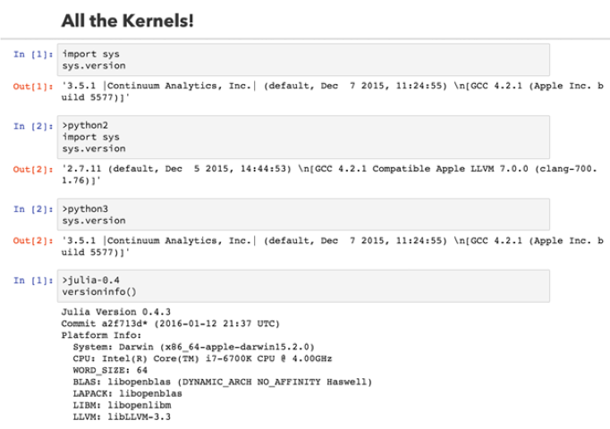
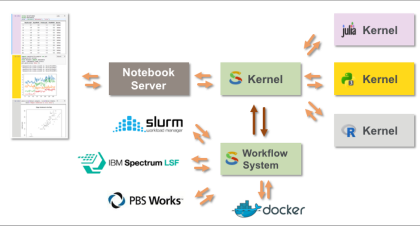
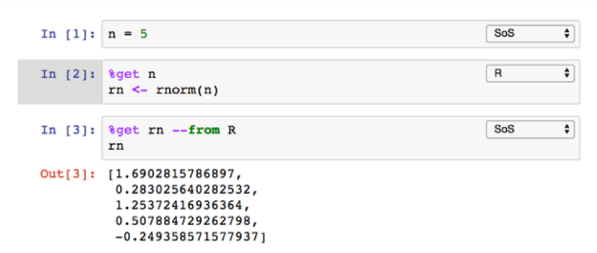
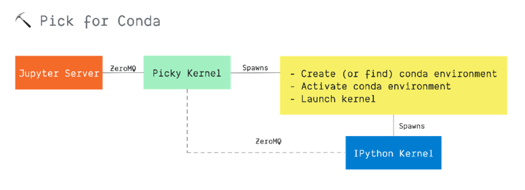

# Summary

This proposal discusses the **transmission of cell metadata** with execute
message requests and would modify the Jupyter Messaging Protocol. Individual
kernels would interpret or ignore this metadata. This enables flexibility in
different usage scenarios implemented in various front-end clients.

# Motivation

By transmitting cell metadata inline with the execute message request, Jupyter
implementations will have a reliable channel to transmit additional metadata
to the kernel in a standard way.

Notebook extensions can also use this channel to transmit additional
information that was often transmitted using magic commands.

Some use cases which motivated this proposal are:

-   Route requests automatically to an appropriate kernel via libraries like
    [allthekernels](https://github.com/minrk/allthekernels) without need for
    additional metadata within the cell itself
-   Create or find a conda environment without needing to use magics, like
    [pick](https://github.com/nteract/pick)
-   Support polyglot (more than one language/kernel within a single notebook)
    scenarios, like [sos](https://vatlab.github.io/sos-docs/)
-   Provide hints to the kernel for localization purposes, like how the
    `ACCEPT_LANGUAGE HTTP` header works
-   Provide hints to the kernel about client capabilities, similar to how
    hints of a web browser client's capabilities work

# Guide-level explanation

Transmitting cell metadata enables many scenarios as described briefly in the
Motivation section. In this section, we consider one scenario in more detail:
running a code cell using a specific kernel. 

Today a typical approach is for the user to include a magic command in the
cell that identifies the kernel. This approach interferes with other
extensions that may want to use the contents of the cell, e.g., autocomplete
providers would now need to be aware of and ignore the syntax of magics.

## Simple example

For example, in the [allthekernels](https://github.com/minrk/allthekernels)
project, users select the kernel using a `><language>` command:

```R
>python3
1+1
```

But in our example, let's imagine that we use cell metadata to specify the
kernel instead. Now, let's consider a minimal JSON fragment for the above
cell: 

```json
{
  "cell_type" : "code",
  "execution_count": 1, 
  "metadata" : {
    "kernel": "python3",
  },
  "source" : "1+1",
}
```

The cell metadata dict contains an entry that specifices that the `kernel` is
`python3`. But where did the `"kernel": "python3"` metadata come from? What
wrote it into the cell metadata in the first place? 

Elaborating a bit more on the user experience here, you could imagine a client
extension providing some additional UI elements such as a cell drop-down that
lets the user pick from a list of installed kernels on the user's machine. The
user picks one, and the kernelspec or its identifier is written to that cell's
metadata.

In this example, there is also a corresponding `allthekernels` kernel that is
installed on the user's machine that knows how to multiplex between different
kernel processes that are running on the user's machine. When the user runs
the cell, the Jupyter implementation will send an
[execute](https://jupyter-client.readthedocs.io/en/stable/messaging.html#execute)
message to the kernel. 

Here's a minimal representation of the execute message for the above cell:

```js
{
  "header" : {
      "msg_id": "...",
      "msg_type": "...",
      //...
  },
  "parent_header": {},
  "content": {
    "code": "1+1",
    "metadata": {
      "kernel": "python3", 
    },
  },
  "content": {},
  "buffers": [],
}
```
 
In this case the `allthekernels` kernel sees the `"kernel": "python3"` entry
in the message, and locates and activates a child kernel to handle the
request, and passes the message onto the child kernel for processing.

There could be other cell metadata that was transmitted from the client as
well. Some of that metadata could have been put there by client extensions,
like in the case of `allthekernels`. Other metadata could be put there by the
Jupyter implementation itself, e.g., language or client capabilities like
screen size.

## Metadata Key Conflicts and Namespacing

The potential for conflicts exists across extensions that want to add their
own cell metadata to notebook file. We recommend that extensions namespace
their metadata keys to minimize the possibility of conflicts between
extensions. For example, in the `allthekernels` case it could look like:

```json
{
  "cell_type" : "code",
  "execution_count": 1, 
  "metadata" : {
    "allthekernels:kernel": "python3",
  },
  "source" : "1+1",
}
```

## Kernels declaring the need for Cell Metadata

Kernels should have a way to declare that they require metadata to be sent.
For a kernel like `allthekernels`, this kernel *needs* to have cell metadata
that specifies the available options. The kernel on receipt of the metadata
can take the appropriate action or warn that it requires additional
information.

# Reference-level Explanation

Cell metadata will be transmitted to the kernel as part of the
[Execute](https://jupyter-client.readthedocs.io/en/stable/messaging.html#execute).
The general form of a message is:

```js
{
  "header" : {
    "msg_id": "...",
    "msg_type": "...",
    //...
  },
  "parent_header": {},
  "metadata": {},
  "content": {},
  "buffers": [],
}
```

Different message types have different schemas for the `content` dict. The
schema of the `content` dict of an **Execute** message follows:

```js
content = {
  // Source code to be executed by the kernel, one or more lines.
  "code" : str,

  // A boolean flag which, if True, signals the kernel to execute
  // this code as quietly as possible.
  // `silent=True` forces `store_history` to be False,
  // and will *not*
  //   - broadcast output on the IOPUB channel
  //   - have an `execute_result`
  // The default is False.
  "silent" : bool,

  // A boolean flag which, if True, signals the kernel to populate history
  // The default is True. Additionally when `silent` is True, `store_history`
  // is forced to be False.
  "store_history" : bool,

  // A dict mapping names to expressions to be evaluated in the
  // user's dict. The rich display-data representation of each will be evaluated after execution.
  // See the `display_data` content for the structure of the representation data.
  "user_expressions" : dict,

  // Some frontends do not support `stdin` requests.
  // If this is True, code running in the kernel can prompt the user for input
  // with an `input_request` message (see below). If it is False, the kernel
  // should not send messages via `stdin`.
  "allow_stdin" : True,

  // A boolean flag, which, if True, aborts the execution queue if an 
  // exception is encountered. If False, queued `execute_requests` will 
  // execute even if this specific request generates an exception.
  "stop_on_error" : True,
}
```

We propose the addition of a new `metadata` dict to the `content` dict schema
in [nbformat](https://nbformat.readthedocs.io/en/latest/). This will be used
to transmit the cell metadata for the executed cell. 

In cases where Jupyter extensions generate their own metadata, that keys for
the metadata should be namespaced using an extension-specific prefix. The
prefix is ideally human-readable and identifies the extension that wrote the
metadata. There is no current provision to guarantee global uniqueness for
these prefixes in a way that other technologies, e.g., XML Namespaces do using
URIs.

Below is a nominal example of these proposals, cell metadata and execute
requests, in action. This fragment of a notebook contains a cell to be
executed. Note that the `kernel` attribute is namespaced using `allthekernels`
and the existing Jupyter attributes `collapsed` and `scrolled` are not
namespaced.

```js
{
  "cell_type" : "code",
  "execution_count": 1, 
  "metadata" : {
    "allthekernels:kernel" : "python3", 
    "collapsed" : True, 
    "scrolled": False, 
  },
  "source" : "1+1",
  "outputs": [{
    "output_type": "stream",
    ...
  }],
}
```

Below is the corresponding EXECUTE message:

```js
{
  "header" : {
      "msg_id": "...",
      "msg_type": "...",
      //...
  },
  "parent_header": {},
  "content": {
    "code": "1+1",
    "metadata": {
      "allthekernels:kernel": "python3", 
      "collapsed": True, 
      "scrolled": False, 
    },
  },
  "content": {},
  "buffers": [],
}
```

# Rationale and Alternatives

## Rejected alternative: Metadata at Root

We considered another approach, root-level cell metadata, before we arrived at
this JEP's proposed recommendation.

Transmitting the metadata as a new root dict in the EXECUTE message is
illustrated here:

```js
{
  "header" : {
      "msg_id": "...",
      "msg_type": "...",
      //...
  },
  "parent_header": {},
  "metadata": {
    "allthekernels:kernel": "python3", 
    "collapsed": True, 
    "scrolled": False, 
  },
  "content": {
    "code": "1+1",
  },
  "buffers": [],
}
```

We decided against this pattern as the metadata is specifically associated
with the code being executed, not on the execute request message itself.
Putting the cell metadata at the root of the payload might conflict with
future execute specific operators for the message payload that might need to
be present beyond the header fields in the future.

## Rejected approach: Allow-List Pattern

In looking at metadata that should or shouldn't be sent, we investigated if
the fields to be passed should be allow-list or block-list pattern matching.
e.g. Allow `allthekernels:kernel` metadata only. The issue is that this
greatly complicates existing applications over the current proposal as kernels
would need to indicate the metadata fields they accept, and clients would then
need to track that and filter fields sent back during execution. The
attributes within the metadata today are: A) small in size and B) not harmful
to send across the wire so keeping the solution simpler was the preferred
pattern in the proposal.

## Impact

This proposal will add a new foundational capability to the Jupyter Messaging
Protocol: the ability to transmit additional information to the kernel which
the kernel can use to make better decisions about execution of user code. This
makes it much more straightforward to have independent collaboration on
polyglot notebooks (notebooks that contain code in more than one programming
language).

If the proposal is accepted, we benefit from an opportunity to improve the
ability to send out-of-band information to the kernel with the EXECUTE
message. Scenarios like polyglot notebooks, or adaptive rendering based on
changes to the user's browser window size or graphics settings would be
realized.

# Prior Art

## allthekernels

`allthekernels` uses a special syntax ("> __kernelspec__") within the cell to
specify the kernel to use to run the code in the cell. This would be replaced
by writing the kernelspec as cell metadata and transmitting it to the kernel
as described earlier in this document.



[GitHub](https://github.com/minrk/allthekernels)

## Script of Scripts (SoS)

`SoS` is a combination of a meta-kernel (authors call it a "super kernel")
that controls a set of child kernels and magic commands to identify the kernel
to target in a cell. It also provides a shared context in the “super kernel”
to share variables and data between different kernels. Requires an extension
to manage language metadata (see screenshot below)




[GitHub](https://github.com/vatlab/sos-notebook)
[JupyterCon Presentation](https://www.youtube.com/watch?v=U75eKosFbp8)
[Documentation](https://vatlab.github.io/sos-docs/notebook.html#content)

## nteract pick

`pick` is a kernel proxy that uses magics to specify an existing conda
environment to use or an environment to create to run code in the notebook.




[Github](https://github.com/nteract/pick)

# Open Questions

We have an opinion around some decision points but would be open to
suggestions around:

- Whether the cell metadata is transmitted as a new dict in the EXECUTE
  message, or whether it is transmitted as a new dict in the content field of
  the EXECUTE message.
- Decide whether kernels need to explicitly declare the metadata that they
  need, and if so, the mechansim for communicating that declaration to the
  Jupyter implementation.
